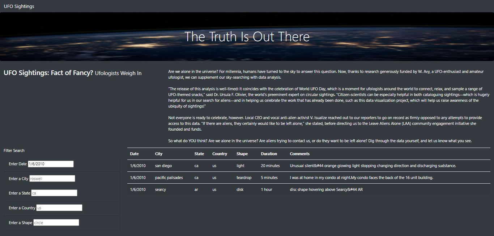

# UFOs
JavaSript Project
Language: JavaScript, HTML, and CSS

## The purpose of this analysis is to build a dynamic webpage to include the following:
-	a table built with data stored in a JavaScript array
-	filters to make the table fully dynamic, and
-	customize the webpage using Bootstrap and equip tables created with fully functional filters that will allow users to interact with the visualizations. 

## Results

### The webpage allow users to filter a UFO sighting database for UFO sighting data from across the world using specific filters like 
-	“Date”, 
-	“City”, 
-	“State”, 
-	“Country” and 
-	“UFO Shape”. 

See webpage with filters below.

## Summary:

### One drawback of the webpage
-	The webpage looks a little confusing without the filter button. Though, the filters do work – adding the filter button will make it more user friendly and more presentable.
-	As it is currently, the webpage has nothing that specifically relates it to the subject matter “UFOs”. 

### Two Additional Recommendations for Further Development
-	Include a “Filter Button”. This will make the webpage more user friendly.
-	Include images that relates more to the subject matter, “UFOs”. This will make the webpage more presentatble and more interesting to look at. 
